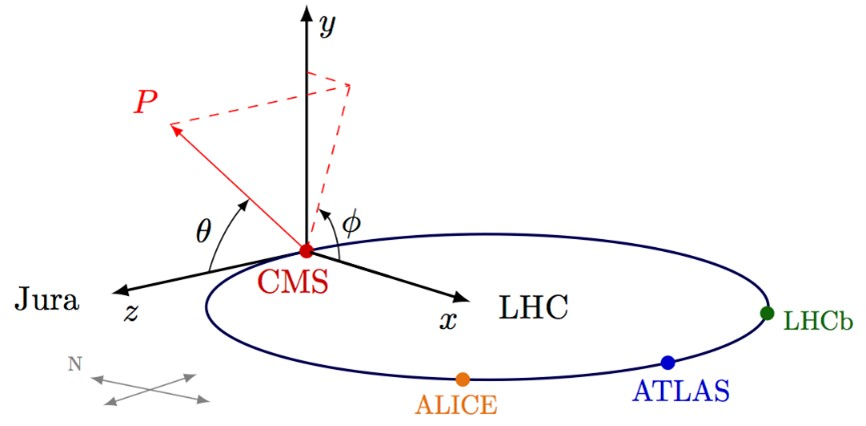

# Time-Series-Forecasting-of-ECAL-Crystal-Calibration-with-LSTM

**Multistep time series forecasting of radiation damage in CMS-ECAL crystals at the LHC using deep learning architectures.**

---

## Overview

The Electromagnetic Calorimeter (ECAL) of the CMS detector at CERN's Large Hadron Collider contains 75,848 lead tungstate (PbWO₄) scintillating crystals. Continuous proton-proton collisions at 13 TeV cause cumulative radiation damage to the crystals, progressively reducing their optical transmission. This degradation is tracked via a **calibration parameter** — the APD/PD ratio measured every ~40 minutes using an onboard laser monitoring system.

This project develops and benchmarks nine LSTM-based neural network architectures for **multistep forecasting** of this calibration signal, with prediction horizons ranging from 1 to 96 steps (approximately 1 to 64 hours). Models are evaluated against a Naive Baseline and a reference architecture from published literature.

The thesis document is available in [`thesis.pdf`](./thesis.pdf).

---

## Problem Statement

Given a time series of calibration measurements for one or more ECAL crystals, along with integrated luminosity as an exogenous variable, predict the calibration values over a future horizon of H steps.

**Why this matters:** Accurate prediction of crystal degradation enables proactive corrections, improves the quality of physics data collected, and supports maintenance planning for future LHC runs (including the High-Luminosity LHC, expected to operate through 2035).

---

## Dataset

Data is publicly available from the CMS experiment open data portal. Each CSV file corresponds to one η-ring of the ECAL barrel and contains approximately 17,000 records per crystal with the following features:

| Column | Description |
|---|---|
| `xtal_id` | Crystal identifier (0–75848) |
| `laser_datetime` | Timestamp of the laser measurement |
| `start_ts` / `stop_ts` | Interval of validity (IOV) boundaries |
| `calibration` | APD/PD ratio — the target variable |
| `int_deliv_inv_ub` | Integrated luminosity delivered up to measurement (µb⁻¹) |
| `time` | Timestamp of the closest luminosity measurement |

Data covers three LHC Run 2 years: **2016, 2017, and 2018**, with measurements at ~40-minute intervals during active collisions.

**To download the data**, follow the instructions in [`data/README.md`](./data/README.md).

---

## Repository Structure

```
├── README.md
├── thesis.pdf
├── requirements.txt
├── data/
│   └── README.md               # Instructions to download CERN open data
├── models/
│   ├── lstm_multioutput.py                    # Single-crystal multioutput LSTM
│   ├── lstm_multioutput_bidirectional.py      # Bidirectional variant
│   ├── lstm_multioutput_ring.py               # Ring-trained multioutput LSTM
│   ├── lstm_multioutput_bidirectional_ring.py # Bidirectional, ring-trained
│   ├── lstm_multioutput_embedding_ring.py     # With crystal ID embedding
│   ├── lstm_seq2seq_arch1.py                  # Seq2Seq: encoder-decoder model fed with exogenous variables in addition to the target variable
│   ├── lstm_seq2seq_arch2.py                  # Seq2Seq: decoder receives only target variable
│   ├── lstm_seq2seq_arch1_ring.py             # Seq2Seq arch1, ring-trained
│   ├── lstm_seq2seq_arch2_ring.py             # Seq2Seq arch2, ring-trained
|   └── seq2seq_art.py                         # Modified Seq2Seq model based on the Joshi et al. paper
├── results/
│   ├── figures/                # All comparison plots by model and horizon
│   └── metrics/
│       
├── baselines/
│   ├── README.md
│   └── naive_baseline.py       # Naive Baseline (last known value)
└── img/
```

---

## Model Architectures

All models use LSTM cells implemented in TensorFlow/Keras. Two forecasting strategies are compared:

### Multioutput (Joint Forecasting)
The model receives an input window of length *d* and produces all *H* future predictions simultaneously through stacked LSTM layers followed by a dense output layer of size *H*. This eliminates error propagation across horizon steps.

### Sequence-to-Sequence (Seq2Seq)
An encoder LSTM processes the full input sequence and compresses it into a latent context vector. A decoder LSTM then generates predictions autoregressively, one step at a time. Training supports **teacher forcing**, **recursive**, and **mixed (scheduled sampling)** strategies.

### Summary Table

| Script | Architecture | Scope | 
|---|---|---|
| `lstm_multioutput.py` | Multioutput LSTM | Single crystal |
| `lstm_multioutput_bidirectional.py` |  Multioutput LSTM Bidirectional | Single crystal |
| `lstm_multioutput_ring.py` | Multioutput LSTM | Full η-ring | 
| `lstm_multioutput_bidirectional_ring.py` |  Multioutput LSTM Bidirectional | Full η-ring | 
| `lstm_multioutput_embedding_ring.py` | Multioutput + Crystal Embedding | Full η-ring | 
| `lstm_seq2seq_arch1.py` | Seq2Seq (encoder+decoder receive all vars) | Single crystal | 
| `lstm_seq2seq_arch2.py` | Seq2Seq (decoder receives target only) | Single crystal | 
| `lstm_seq2seq_arch1_ring.py` | Seq2Seq Arch1 | Full η-ring | 
| `lstm_seq2seq_arch2_ring.py` | Seq2Seq Arch2 | Full η-ring | 

**η-ring:** Crystals in the ECAL barrel are organized in rings of constant pseudorapidity 

$$
\eta=\ln\left(\tan\left(\frac{\theta}{2}\right)\right)
$$


---

## Results

Models are evaluated using **MAPE** (Mean Absolute Percentage Error) for single-crystal tasks and **WMAPE** (Weighted MAPE, weighted by number of measurements per crystal) for ring-level evaluation. All results are reported on 2017 test data, trained on 2016.

### Single-Crystal Models (Crystal 30600, Anillo 1)

| Model | Avg. improvement over Naive Baseline at H=96 |
|---|---|
| Multioutput LSTM | +13.9% |
| Bidirectional Multioutput | +13.5% |
| **Seq2Seq Architecture 1** | **+40.9%** |
| Seq2Seq Architecture 2 | +21.1% |
| Seq2Seq (reference article) | +30.7% |

The **Seq2Seq Architecture 1** achieves the best performance for medium-to-long horizons (12–96 steps). Single-step prediction (H=1) remains challenging for all models due to the high-frequency noise in the calibration signal.

### Ring-Level Models (η-ring 1, 2017)

Ring-trained models underperform the Naive Baseline across most horizons, indicating that the shared-weight assumption does not generalize well across crystals with heterogeneous degradation behavior. Only **Seq2Seq Architecture 2** achieves a positive improvement (+8.5%) at H=96.

### Baseline Comparison

The Naive Baseline (repeat last known value) achieves MAPE ≈ 0.50 at H=48 steps (~32 hours) for crystal 30600. The best single-crystal model (Seq2Seq Arch1) reduces this to MAPE ≈ 0.35 at the same horizon.

---

## Key Technical Findings

- **Batch normalization** consistently degrades performance across all architectures.
- **MinMaxScaler** on both inputs and outputs is required; models without output scaling produce nonsensical results.
- **Dropout of 0.2** provides the best regularization balance.
- **Teacher forcing** outperforms recursive decoding for single-step-ahead training; **mixed (scheduled sampling)** is more stable for longer horizons.
- The `delta_lumi` (luminosity increment per measurement interval) is the most predictive exogenous feature, with Spearman correlations to calibration ranging from −0.50 to −0.74 depending on crystal position.
- A bug in the reference paper's training loop (incorrect batch iteration) was identified and corrected; the fixed model achieves MAPE = 0.36 vs. MAPE = 1.84 of the original at H=48 steps.

---

## Installation

```bash
git clone https://github.com/<your-username>/<repo-name>.git
cd <repo-name>
pip install -r requirements.txt
```

**Requirements:** Python 3.9+, TensorFlow 2.x, pandas, numpy, scikit-learn, matplotlib.

---

## Usage

Each script in `models/` is self-contained. To run a model:

```bash
python models/lstm_seq2seq_arch1.py
```

Scripts expect data in `data/` following the format described in `data/README.md`. Output plots and metrics are saved to `results/`.

---

## Reference

This work extends and benchmarks the methodology from:

> Joshi, B., Li, T., Liang, B., Rusack, R., & Sun, J. (2023). *Predicting the future of the CMS detector: Crystal radiation damage and machine learning at the LHC.*

---

## License

Data is subject to CERN open data licensing terms. Code in this repository is released under the MIT License.
