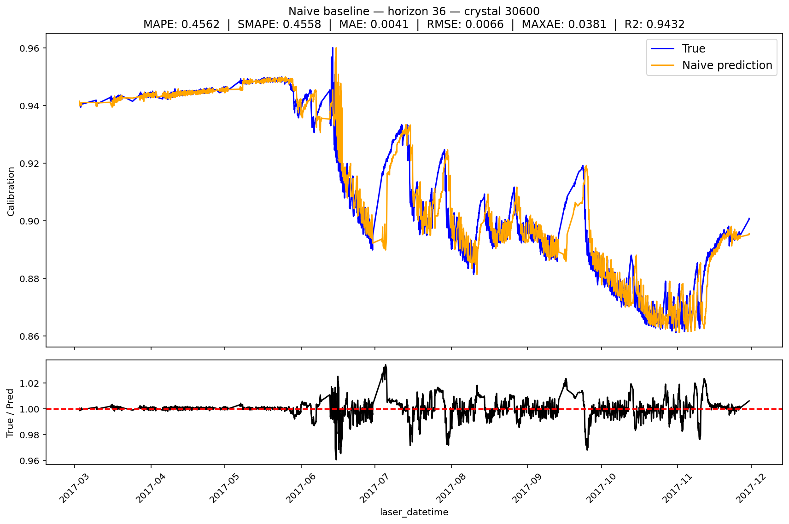

## Naive Baseline

The Naive model is based on the simplest possible assumption: the next value in the time series will be equal to the immediately previous value.

Formally:

$$
y_t = y_{t-1}
$$

In our case, since we work with multi-step sequence windows, the Naive model is interpreted as a simple forward shift of the observed values. In other words, to predict multiple future steps, the model uses values from previous time steps according to the prediction horizon length.

For example, suppose we need to predict a total of 5 time steps using a prediction horizon of 2 steps. The model outputs would be:

$$
y_1 = \text{No prediction}
$$

$$
y_2 = \text{No prediction}
$$

$$
y_3 = y_1
$$

$$
y_4 = y_2
$$

$$
y_5 = y_3
$$

This means that the model simply replicates previous values from the series while shifting them according to the prediction horizon length.

This approach serves as a minimum reference baseline for evaluating the performance of more complex models. Because it relies on the simplest possible assumption, it represents our lower performance bound. Hence the name **Naive Baseline**, since any model considered successful should achieve a lower MAPE value than this baseline.

